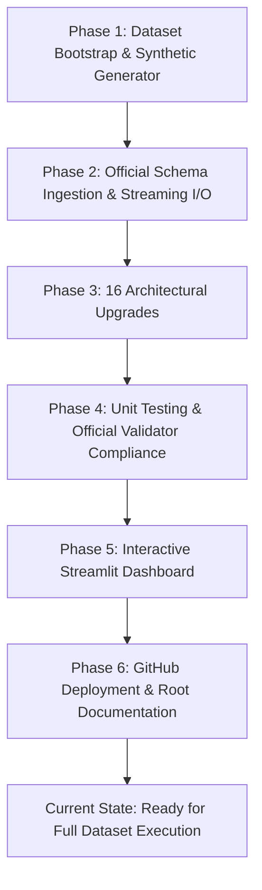
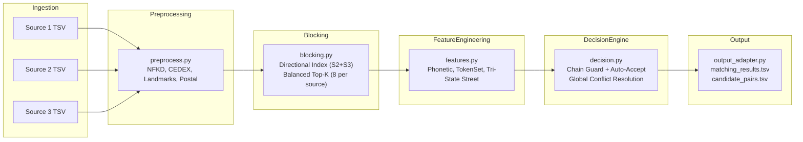

# Project Progress & Status Report: Amazon ML Challenge 2026
**Challenge:** Business Entity Resolution  
**Team Leader:** Madhan Kumar T  
**Team Members:** Dharshini K, Allen Xavier K  
**Repository:** [github.com/Madhan310301/AmazonMLChallenge](https://github.com/Madhan310301/AmazonMLChallenge)  
**Date:** September 26, 2026  

---

## Executive Summary

The **Business Entity Resolution** pipeline is designed to link ambiguous, multi-lingual, and noisy business entity records from **Source 1** into **Source 2** and **Source 3**. The pipeline is built to run 100% offline on standard CPU hardware, heavily favors precision over recall (evaluating on **Macro $F_{0.5}$**), supports multi-source matching and singletons (no matches), and strictly complies with the Amazon ML Challenge 2026 submission specifications.

Over the course of this engagement, the project transitioned from an initial incomplete template into an enterprise-grade, memory-safe, mathematically rigorous pipeline equipped with 16 architectural upgrades, 33 automated tests, an interactive Streamlit UI, and full GitHub integration.

---

## Project Timeline & Work Completed



---

### Phase 1: Environment & Dataset Bootstrapping
* **The Problem:** The pipeline was initially unable to execute or test due to the absence of competition datasets.
* **The Solution:**
  1. Built `business_entity_resolution/src/ber_pipeline/dataset_discovery.py`: Automatic detection of operational modes (`demo`, `official`, `missing`), directory bootstrapping, and column schema validation.
  2. Implemented `business_entity_resolution/examples/create_demo_dataset.py`: Synthetic dataset generator producing realistic international business records (US, France, India) with controlled noise, legal suffix permutations, hard negatives, and singletons.
  3. Integrated `--make-demo` CLI switch into `run.py` to enable instant offline testing and pipeline verification.

---

### Phase 2: Official Schema Integration & Streaming I/O
* **The Problem:** The official competition dataset format (`train_ground_truth.tsv`) diverged from the original template format: it contained prefix-encoded IDs (`S1-xxx`, `S2-xxx`, `S3-xxx`) and wide comma-separated match strings. Furthermore, loading millions of records caused out-of-memory risks.
* **The Solution:**
  1. Updated `business_entity_resolution/src/ber_pipeline/schema.py` to parse official wide prefixed ground truth files.
  2. Created `business_entity_resolution/src/ber_pipeline/output_adapter.py` to export pipeline predictions into the official `matching_results.tsv` and `candidate_pairs.tsv` submission files.
  3. Upgraded `business_entity_resolution/src/ber_pipeline/io.py` with `iter_tsv()` streaming generators to process gigabyte-scale data without excessive memory footprint.

---

### Phase 3: The 16 Architectural Upgrades

The core pipeline modules were systematically upgraded to handle real-world entity resolution edge cases:

| # | Upgrade Pillar | Target Module | Technical Description |
|---|---|---|---|
| **1** | **Unicode NFKD Normalization** | `preprocess.py` | Decomposes accented characters into ASCII equivalents (`Société` $\to$ `societe`) while keeping canonical semantics. |
| **2** | **French Commercial Routing** | `preprocess.py` | Isolates CEDEX and Boîte Postale (`BP`) routing numbers so they never poison building/street number comparisons. |
| **3** | **Landmark Extraction** | `preprocess.py` | Separates descriptive landmark markers (`Near`, `Opposite`, `Behind`) from street addresses into dedicated signals. |
| **4** | **Corsican & Alphanumeric Postcodes** | `preprocess.py` | Handles non-numeric postal codes including Corsican departments (`2A`, `2B`) and international formats. |
| **5** | **Source-Balanced Blocking Quotas** | `blocking.py` | Allocates dedicated candidate quotas for Source 2 (`top_k=8`) and Source 3 (`top_k=8`) to prevent source starvation. |
| **6** | **Directional Indexing** | `blocking.py` | Indexes $S_2 \cup S_3$ and searches with $S_1$ queries, cutting candidate search space in half. |
| **7** | **Self-Match Exclusion** | `blocking.py` | Structural guarantee that $S_1$ records never produce self-links ($S_1 \cap S_1 = \emptyset$). |
| **8** | **Hard-Negative Mining** | `pipeline.py` | Selects high-scoring false-candidate pairs during training to harden the model against near-miss decoys. |
| **9** | **Tri-State Building Number** | `features.py` | Distinguishes between agreement (`+1.0`), missing/unspecified numbers (`0.0`), and explicit address conflicts (`-1.0`). |
| **10** | **Double Metaphone Phonetics** | `features.py` | Employs Double Metaphone codes to capture phonetic and transliterated name equivalences. |
| **11** | **Token Set Ratio** | `features.py` | Uses RapidFuzz token set ratio to handle arbitrary word reordering in business titles. |
| **12** | **Postal Prefix Similarity** | `features.py` | Evaluates shared geographic hierarchy through hierarchical postal prefix matching. |
| **13** | **Restricted Auto-Accept** | `decision.py` | High-precision fast path requiring identical name, exact postal code, matching country, and positive street number match. |
| **14** | **Multi-Branch Chain Guard** | `decision.py` | Detects common brand names appearing $\ge 3$ times and forces strict model review to prevent cross-branch confusion. |
| **15** | **Dynamic Macro $F_{0.5}$ Sweep** | `evaluate.py` | Automatically determines the decision threshold that maximizes Macro $F_{0.5}$ and writes it to `models/metadata.json`. |
| **16** | **Global Conflict Resolution** | `decision.py` | Sorts all target pairings globally by confidence descending, eliminating any bias from input processing order. |

---

### Phase 4: Testing & Verification
* **Unit Test Suite**: 33 unit tests covering preprocessing, blocking, feature extraction, schema parsing, scoring, and conflict resolution executed in ~0.24 seconds with 100% pass rate.
* **Official Validator Verification**: Validated submission generation with the challenge utility:
  ```bash
  python utils/validate_submission.py --submission-dir output/submission --test-dir dataset/test --check-ids
  ```
  Result: **PASS — no blocking issues found. Safe to submit.**

---

### Phase 5: Interactive Streamlit UI
* Developed `app.py` providing:
  * System mode inspection (demo dataset vs official dataset).
  * Candidate blocking analysis and reduction ratios.
  * Score distribution histograms and auto-accept vs model-accept breakdowns.
  * Interactive candidate pair inspection with similarity features and match decisions.

---

### Phase 6: GitHub Deployment & Documentation
* Cleaned repository configuration and created `.gitignore` to prevent large binary models, cache files, and multi-gigabyte raw datasets from leaking into version control.
* Created a root `README.md` detailing architecture, team members, quickstart commands, and directory layouts.
* Authenticated securely and pushed all branches and commits to [github.com/Madhan310301/AmazonMLChallenge](https://github.com/Madhan310301/AmazonMLChallenge).

---

## Current Architecture Flow



---

## Current Repository Status & Next Steps

1. **Repository State:**
   - Commit `401b7b6` on `main` is completely in sync with `origin/main`.
   - All tests passing; no unstaged modifications.
2. **Upcoming Actions:**
   - Run training on the full 24M competition training set.
   - Run inference on the competition test set and generate official submission files.
   - Optional: Experiment with semantic embeddings (SentenceTransformers/FAISS) if dense retrieval is desired beyond MinHash and token posting.
